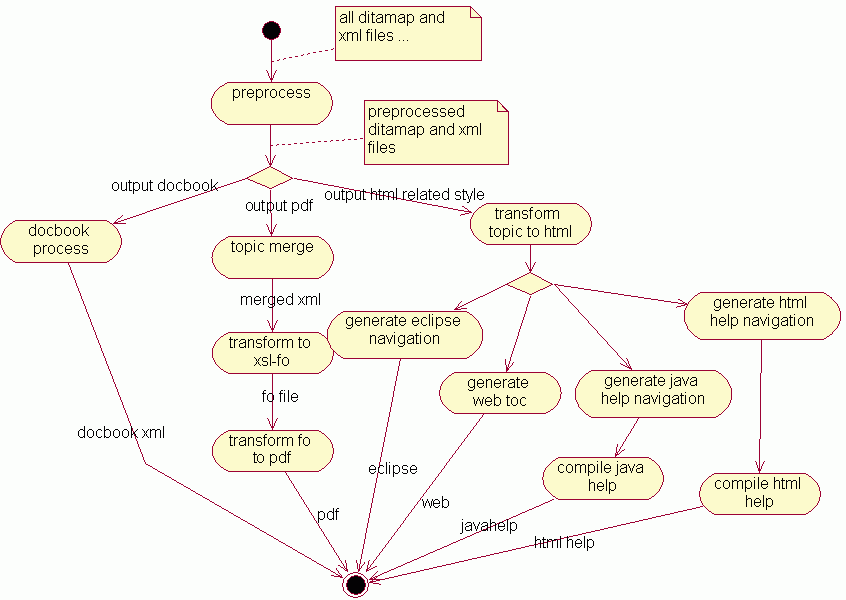

# Processing structure

The DITA-OT implements a multi-stage, map-driven architecture to process DITA content. Each stage in the process examines some or all of the content; some stages result in temporary files that are used by later steps, while others stages result in updated copies of the DITA content. Most of the processing takes place in a temporary working directory; the source files themselves are never modified.

The DITA-OT is designed as a pipeline. Most of the pipeline is common to all output formats; it is known as the pre-processing stage. In general, any DITA process begins with this common set of pre-processing routines. Once the pre-processing is completed, the pipeline diverges based on the requested output format. Some processing is still common to multiple output formats; for example, Eclipse Help and HTML Help both use the same routines to generate XHTML topics, after which the two pipelines branch to create different sets of navigation files.

The following image illustrates how the pipeline works for some common output types: DocBook, PDF, Eclipse Help, XHTML, JavaHelp, and HTML Help.

